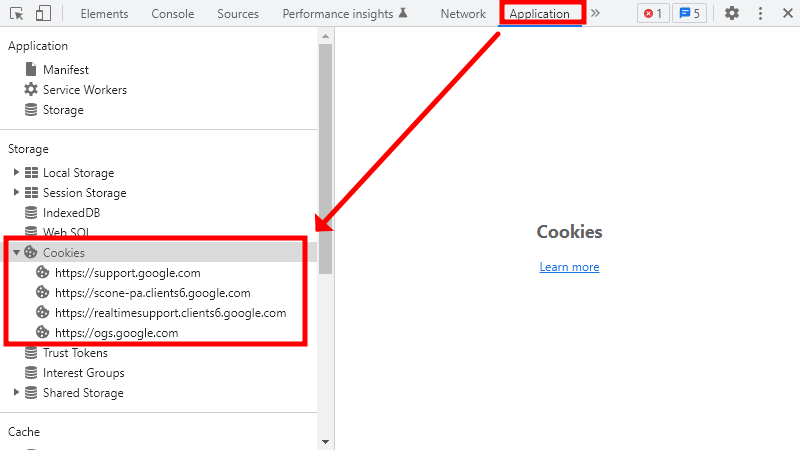
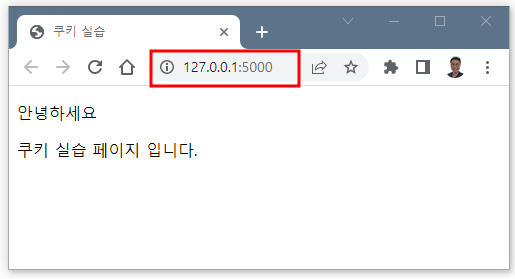
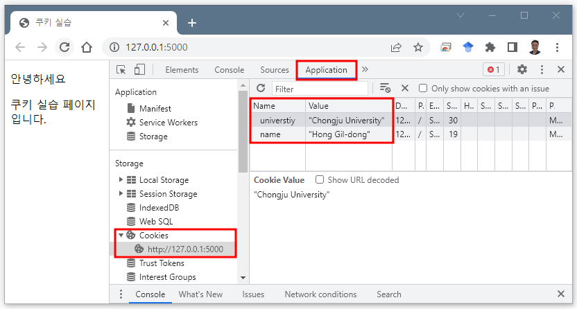
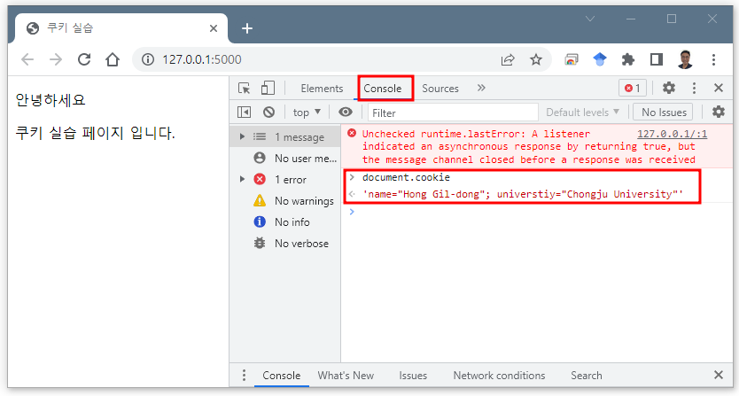
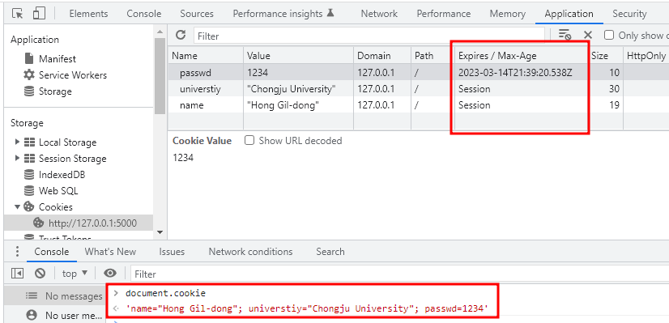
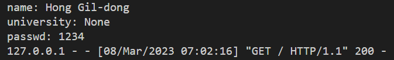

# 쿠키 (Cookie)

## 개념

쿠키(HTTP cookie)란 하이퍼 텍스트의 기록서(HTTP)의 일종으로서 인터넷 사용자가 어떠한 웹사이트를 방문할 경우 사용자의 웹 브라우저를 통해 인터넷 사용자의 컴퓨터나 다른 기기에 설치되는 `작은 기록 정보 파일(텍스트 파일)`을 의미합니다. 쿠키, 웹 쿠키, 브라우저 쿠키라고도 부르기도 합니다 (자료출처: [Design ＆ Implementation of License-based Digital Rights Management System](10.3745/kipstc.2004.11c.1.055)). 


쿠키 파일에 담긴 정보는 인터넷 사용자가 같은 웹사이트를 방문할 때마다 읽히고 수시로 새로운 정보로 바뀐다. 이 수단은 넷스케이프의 프로그램 개발자였던 루 몬툴리(Lou Montulli)가 고안한 뒤로 오늘날 많은 서버 및 웹사이트들이 브라우저의 신속성을 많이 사용하고 있습니다 (자료출처: [Giving the Web a Memory Cost Its Users Privacy](https://www.semanticscholar.org/paper/Giving-the-Web-a-Memory-Cost-Its-Users-Privacy-Schwartz/77c388be3f57c80889e5291dc103f8f375718f56)).

## `쿠키`, 이름의 유래

"쿠키"라는 용어는 웹 브라우저 프로그래머 루 몬툴리가 만들었습니다. 쿠키는 유닉스 프로그래머들이 사용한, 프로그램이 수신 후 변경하지 않은 채로 반환하는 데이터의 패킷을 의미하는 `매직 쿠키`라는 용어에서 비롯되었습니다. (자료출처: [Where cookie comes from](http://dominopower.com/article/where-cookie-comes-from/))

[루 몬툴리](https://en.wikipedia.org/wiki/Lou_Montulli) 라는 컴퓨터 프로그래머가 웹 통신에서 쿠키를 사용하려는 아이디어를 갖게 된 1994년에 이미 `매직 쿠키`라는 개념은 사용되고 있었습니다.

당시 넷스케이프 케뮤니케이션사의 직원이었던 몬툴리는 [MCI](https://en.wikipedia.org/wiki/MCI_Inc.)사의 전자상거래 애플리케이션을 개발하고 있었습니다.

MCI사의 기술 대표인 [빈 서프(Vint Cerf)](https://en.wikipedia.org/wiki/Vint_Cerf)와 [존 클렌신(John Klensin)](https://en.wikipedia.org/wiki/John_Klensin)은 넷스케이프사와 회의를 하고 있었습니다. 그 회의에서 MCI사 서프와 클렌신은 거래 상태 정보를 서버에 남기고 싶어하지 않았고, 거래 상태 정보를 사용자의 개인 컴퓨터에 남길수 있는 방법을 넷스케이프사에 요청하였습니다. 이런 MCI사의 요청으로 신뢰성 있는 온라인 쇼핑 카트를 구현할 수 있는 해결책으로 `쿠키`라는 것이 제시되었습니다.

그 즈음에 넷스케이프의 [루 몬툴리](https://en.wikipedia.org/wiki/Lou_Montulli)와 [존 지안드레아(John Giannandrea)](https://en.wikipedia.org/wiki/John_Giannandrea) 1994년 10월에 출시된 [베타 버전의 Mosaic Netscape](https://en.wikipedia.org/wiki/Netscape_Navigator) 라는 브라우저에서 사용할 네스케이프 쿠키 스펙을 작성하였습니다.

쿠키를 처음 사용한 것은 넷스케이프 웹사이트를 방문하는 사용자들이 사이트를 이전에 방문했었는지를 확인(check)하는 것이었습니다.

몬툴리는 1995년에 쿠키 기술에 대한 특허를 출원하였고 1998년에 특허를 승인(등록) 받았습니다.

1998년 특허가 승인되자 쿠키 기술은 1995년에 출시된 인터넷 [익스플로러 버전 2](https://en.wikipedia.org/wiki/Internet_Explorer_2)에 추가되었습니다.

쿠키 기술은 처음에는 잘 알려지지 않았습니다. 특히 인터넷 기술에 기본적으로 채용되었지만 사용자들은 자신들이 쿠키를 사용하고 있는지도 모르고 있었습니다. 

일반 사용자들은 쿠키의 존재를 [파이낸셜 타임즈](https://en.wikipedia.org/wiki/Financial_Times)가 1996년 2월에 쿠키 관련 기사를 발표하면서 본격적으로 알려지게 되었습니다.

이후 쿠키는 언론의 뜨거운 관심을 받는 기술이 되었으며, 특히 개인 정보에서 문제의 소지가 있다는 것이 알려지게 되었습니다.

쿠키 기술에 대한 스펙은 1995년 `Internet Engineering Task Force` [(IETF)](https://en.wikipedia.org/wiki/Internet_Engineering_Task_Force)에서 이미 논의되고 있었습니다. 그 당시 2가지 기술이 각각 IETF에 제안되었습니다.

- `오픈소스 스프트웨어 운동`([open source software movement](https://en.wikipedia.org/wiki/Open-source-software_movement)) 진영의 브라이언 벨렌도르프[(Brian Behlendorf)](https://en.wikipedia.org/wiki/Brian_Behlendorf)가 제안한 쿠키 기술

<div style="text-align:center">
    
</div>

-  New Jersey Institute of Technology (NJIT) 대학의 명예교수였던 데이비드 크리스톨[(David Kristo)](https://en.wikipedia.org/wiki/David_Kristol)이 제안한 쿠키 기술
<div style="text-align:center">
    
</div>

하지만 `데이비드 크리스톨`과 `루 몬툴리`가 지휘하던 IETF는 곧바로 자신들이 제안한 넷스케이프의 쿠키 기술을 쿠키 초기 기술로 채택하게 됩니다.

IETF의 Working Group은 1996년에 제3자에 의해 제공되는 쿠키 기술이 개인정보 침해의 잠재적 위험성이 있다는 것을 식별해 냅니다.

IETF는 1997년 제3자 쿠키를 허용하지 않거나 최소한 기본 설정으로 지원하는 것을 금지하는 내용이 담긴 기술표준 [RFC 2109](https://www.ietf.org/rfc/rfc2109.txt)를 발표합니다. 

`제3자 쿠키`란 주로 광고 플랫폼(애드 테크) 회사들이 여러 사이트에 걸쳐 일어나는 사용자의 행동 데이터를 수집하고 광고 타겟팅에 사용하기 위해 추가하는 쿠키로 제3자 쿠키, 서드파티 쿠키, 3사 쿠키 등으로 불리기도 합니다(출처: [서드파티 쿠키 종말을 대비하는 10가지 방법](https://www.digiocean.co.kr/p/blog?p=cookieless-world-10-ways)). 즉 제3자 쿠키는 방문한 웹사이트가 아닌 다른 웹사이트에서 발행한 쿠키를 의미합니다(출처: [쿠키 그리고 서드파티 쿠키란 무엇일까 (Cookie) - RS Team](https://blog.rs-team.com/12)). 방문한 웹사이트에서 발행한 쿠키는 `퍼스트 파티 쿠키`(First-party Cookie)라고 부릅니다.

제3자 쿠키는 각기 다른 도메인으로 이루어진 사이트의 사용내역에 대한 정보를 쿠키로부터 가져와 활용할 수 있기 때문에 사용자의 온라인상 행동을 추적 및 데이터를 분석하여 광고 등에 사용할 수 있습니다. 웹사이트 운영자에게는 매력적이지만 개인에게는 소중한 개인정보가 유출되는 심각한 상황에 이를 수 있습니다.

[RFC 2109](https://www.ietf.org/rfc/rfc2109.txt)가 발표될 당시에는 이미 많은 광고 회사들이 이미 제3자 쿠키를 사용하고 있었기 때문에 넷스케이프와 익스플로러 이용자들에게 적용될 수 없었으며 2000년 10월에 [RFC 2965](https://www.ietf.org/rfc/rfc2965.txt) 표준으로 대체되기에 이릅니다.

[RFC 2965](https://www.ietf.org/rfc/rfc2965.txt)에서는 HTTP 헤더에 `Set-Cookie2`를 설정하는 방법을 추가하였습니다(비공식적으로는 "`RFC 2965 style 쿠키`"라고 부릅니다). 

하지만 `Set-Cookie2` 방식 역시 개발자들에게 외면 받게 되고 결국 2011년 4월에 [RFC-6265](https://datatracker.ietf.org/doc/rfc6265/) 표준으로 대체됩니다.

- CSS 발전과정 (이미지를 클릭해 주세요)

[](https://datatracker.ietf.org/doc/rfc6265/)
</div>


결국 1994년 시작된 쿠키는 [RFC-6265](https://datatracker.ietf.org/doc/rfc6265/) 표준에 이르러 안정을 찾게 되고, 현재 우리가 사용하고 있는 쿠키는 [RFC-6265](https://datatracker.ietf.org/doc/rfc6265/) 표준을 따르고 있습니다.


## Cookie 용도

그렇다면 왜 쿠키를 사용하는 걸까요?

HTTP 프로토콜은 무상태(stateless) 프로토콜입니다. 다시 말해 서버는 사용자가 처음으로 방문하는지 아니면 이전에 방문한 적이 있는지 알 방법이 없습니다. 이런 문제점을 해결하기 위해 쿠키를 사용합니다.

사용자가 처음 서버를 방문한다면 당연히 쿠키가 없겠죠? 서버는 쿠키가 없다는 정보를 이용해 첫 방문이라는 것을 알 수 있습니다. 쿠키가 없는 사용자일 경우 서버는 쿠키를 구워서 사용자 컴퓨터에게 전송합니다. 사용자 컴퓨터의 브라우저는 쿠키를 받아서 저장하게 됩니다. 

서버가 만든 쿠키(텍스트 파일)를 클라이언트(브라우저)에 저장하도록 시키는 겁니다. 쿠키는 브라우저에 영구적으로 저장할 수도 있고, 일정 기간만 유효하도록 지정할 수도 있습니다. 유효 시간이 설정된 경우 유효 시간이 지나면 브라우저가 쿠키를 삭제해 줍니다.


쿠키는 주로 3가지 목적을 위해 사용합니다.

- 세션 관리(Session Management): 서버에 저장해야 할 로그인, 장바구니, 게임 사용자 정보 등을 저장하여 세션 관리를 편하게 하려고 사용합니다.
- 개인화(Personalize): 웹 사용자의 선호도를 관리하고 개인 취향에 맞는 테마 등과 같은 사용자 맞춤형 환경을 제공하기 위해 사용합니다.
- 트래킹(Tracking): 웹 사용자의 사용 패턴을 추적, 기록, 분석하기 위해 사용합니다.

부가적으로 사용자 편리성을 제공하기 위해 사용하기도 합니다.
- 로그아웃 하지 않고 웹사이트를 떠난 경우, 다음에 해당 사이트를 방문하면 자동으로 로그인 되도록 할 수 있습니다.
- 사용자의 브라우저 검색 기록을 쿠키에 저장했다가 맞춤형 상품 추천을 하기 위해 사용하기도 합니다.

쿠키는 여러모로 웹사이트 운영자와 사용자들에게 편리함을 줍니다. 하지만, 그에 따른 부작용도 항상 존재합니다.

예전에는 쿠키를 항상 사용자의 웹 브라우저에 저장하였지만, 최근에는 [웹 스토리지 API](https://developer.mozilla.org/ko/docs/Web/API/Web_Storage_API) 기술을 이용하여 세션이 연결되었을 경우에만 쿠키를 사용하는 `sessionStorage`와 옛날과 같이 사용자 웹 브라우저에 저장하는 `localStorage` 기술을 모두 사용할 수 있게 되었습니다.


# Cookie 실습
## 브라우저에서 쿠키 확인하기
웹 브라우저를 이용하면 쉽게 쿠키를 확인할 수 있습니다. 

우리는 크롬 브라우저를 이용해 보도록 하겠습니다.

크롬 메뉴 $\to$ 개발자 도구 $\to$ Application $\to$ Cookie $\to$ 해당 사이트의 쿠키 정보 확인

<div style="text-align:center">
    <figure>
        
        <figcaption>크롬 개발자도구 메뉴</figcaption>
    </figure>
</div>

쿠키 삭제, 허용, 관리하기는 구글 크롬의 [고객센터](https://support.google.com/chrome/answer/95647?hl=ko&co=GENIE.Platform%3DDesktop)를 참고하기 바랍니다.

## 쿠키 실습용 서버 만들기

쿠키는 서버가 만들어서 클라이언트에 저장하는 작은 크기의 정보입니다. 당연히 서버가 필요하겠죠?

플라스크를 이용해 실습용 웹서버를 하나 만들어 보겠습니다.

먼저 가상환경에 flask를 설치합니다.

```{bash}
# Flask 설치 (가상환경에 설치)
$ pip install Flask

# 설치 확인
$ python
>>> import flask
>>> flask.__version__
'2.2.3'
```

템플릿 파일(`html`) 파일을 저장하기 위한 `templates`폴더를 하나 만들어 주세요. (`templates`에 오타가 나지 않도록 주의합니다.)
```{bash}
$ cd server
$ mkdir templates
```

`templates` 폴더에 `index.html` 이라는 파일을 만들겠습니다.
파일 내용은 실습이 목적이므로 간단하게 작성합니다.
```{html}
<!DOCTYPE html>
<html lang="en">
<head>
    <meta charset="UTF-8">
    <meta http-equiv="X-UA-Compatible" content="IE=edge">
    <meta name="viewport" content="width=device-width, initial-scale=1.0">
    <title>쿠키 실습</title>
</head>
<body>
    <p>안녕하세요</p>
    <p>쿠키 실습 페이지 입니다.</p>
</body>
</html>
```

`cookie_server.py` 파일을 만들도록 하겠습니다.

`cookie_server.py` 내용을 다음과 같이 작성합니다.

```{python}
''' 파일 경로
(venv) path_to_project_directory/cookie_server.py
'''

from flask import Flask, render_template

app = Flask(__name__)

@app.route('/')
def hello_cju():
    return render_template(
        'index.html'
    )

if __name__=='__main__':
    app.run()
from flask import Flask, render_template

app = Flask(__name__)

@app.route('/')
def hello_cju():
    return render_template(
        'index.html'
    )

if __name__=='__main__':
    app.run()
```

현재까지 파일 구조는 다음과 같습니다.

```{bash}
--- (여러분의 프로젝트 디렉토리)
    |
    ---- templates
    |    |
    |    ---- index.html
    ---- venv
    cookie_server.py
```

이제 서버를 가동시키겠습니다.

`sever` 폴더로 이동한 다음 아래 명령어를 차례로 실행합니다.

```{bash}
(venv) $ python cookie_server
 * Serving Flask app 'cookie_server'
 * Debug mode: off
    WARNING: This is a development server. 
    Do not use it in a production deployment. 
    Use a production WSGI server instead.
 * Running on http://127.0.0.1:5000
```

위와 같은 메시지가 출력된다면 정상적으로 서버가 실행된 것입니다.
메시지 중에서 현재 서비스하고 있는 URL이 보입니다.

\* Running on [http://127.0.0.1:5000](http://127.0.0.1:5000)

만약 VS Code로 개발을 하고 있다면 키보드 Ctl 키를 누른 상태에서 메시지의 URL을 클릭하면 서버에서 제공하는 웹페이지에 접속할 수 있습니다.

만약 로컬 PC에서 실행한 경우라면 웹 브라우저 주소창에 `http://127.0.0.1:5000` 입력하고 아래 화면이 뜨면 정상입니다.

<div style="text-align:center">
    <figure>
        
        <figcaption>쿠키 테스트 서버</figcaption>
    </figure>
</div>

Flask 서버를 실행할 때 필요한 몇 가지 옵션을 살펴보겠습니다.
- `debug`: 디버그 모드를 적용 여부를 지정
  - `True`: flask 서버를 구성하는 소스코드 변경이 있을 경우 자동으로 재시작, 에러가 발생하면 `Traceback` 메시지 제공
  - `False`: 소스코드 변경이 있을 경우 서버를 수동으로 재시작 해야 함, `default` 값은 `False`
- `host`: flask 서버에 접근 가능한 IP 주소를 설정합니다.
  - `0.0.0.0`: 어떤 IP 주소라도 내 서버에 접근하는 것을 허용
  - `default`: 아무것도 지정하지 않으면 `localhost`(127.0.0.1)로 자동 설정
- `port`: flask 서버가 사용할 포트 번호
  - `특정 숫자`: 지정한 숫자로 포트 개방
  - `default`: 아무것도 지정하지 않으면 `5000`번으로 자동 설정

아마존(AWS), 네이버 클라우드(Ncloud), 사내 서버, 학교 실습 서버 등과 같은 원격 서버에서 작업할 경우 `host`와 `port`를 설정해 주어야 합니다.

만약 원격 서버에서 flask를 가동시킨 후 모든 컴퓨터가 `5001` 포트로 접속하게 하려면 다음과 같이 코딩하면 됩니다.

```
         :
    (중간 생략)
         :
if __name__=='__main__':
    # app.run()
    app.run(host='0.0.0.0', port='80', debug=True)
```
* 코드가 잘 작동하려면 서버 방화벽에서 `5001`번 포트를 개방해 줘야 합니다.

위 코드를 적용한 `cookie_server.py`는 다음과 같습니다.

```{python}
from flask import Flask, render_template

app = Flask(__name__)

@app.route('/')
def hello_cju():
    return render_template(
        'index.html'
    )

if __name__=='__main__':
    app.run(host='0.0.0.0', port='5001', debug=True)
```

서버를 실행하면 터미널에 다음과 같은 메시지가 출력됩니다.


```{bash}
(venv) kafa46@cju-security:~/workspace/security_class/wk05_cookie_practice$ python cookie_server.py 
 * Serving Flask app 'cookie_server'
 * Debug mode: on
WARNING: This is a development server. 
Do not use it in a production deployment. 
Use a production WSGI server instead.
 * Running on all addresses (0.0.0.0)
 * Running on http://127.0.0.1:5001
 * Running on http://10.41.49.108:5001
Press CTRL+C to quit
 * Restarting with stat
 * Debugger is active!
 * Debugger PIN: 385-096-099
182.209.156.73 - - [01/Apr/2023 04:13:08] "GET / HTTP/1.1" 200 -
182.209.156.73 - - [01/Apr/2023 04:13:08] "GET /favicon.ico HTTP/1.1" 404 -
```


## 쿠키 만들어서 사용자 브라우저에 저장하기

실습용 서버를 만들었으니 쿠키를 발행해 보겠습니다.

이전에 만들었던 `cookie_server.py` 내용을 다음과 같이 변경합니다.
참고로 쿠키를 구으려면 

```{python}
from flask import Flask, make_response, render_template

app = Flask(__name__)

@app.route('/')
def hello_cju():
    '''초기 접속 시 실행할 함수'''
    # return render_template(
    #     'index.html'
    # )

    # 쿠키 굽기(발행)
    response = make_response(
        render_template('index.html')
    )

    response.set_cookie('name', 'Hong Gil-dong') # 쿠키 굽기
    response.set_cookie('universtiy', 'Chongju University') # 또 다른 쿠키 굽기

    return response
```

서버가 제공하는 `http://127.0.0.1:5000` 페이지를 새로고침하면 쿠키를 확인할 수 있습니다.

- 쿠키 확인 방법 1. 
  - 개발자도구 $\to$ application $\to$ Cookie $\to$ 쿠키를 발행한 서버 주소
<div style="text-align:left">
    <figure>
        
        <figcaption>Application 메뉴를 이용해서 쿠키 확인</figcaption>
    </figure>
</div>

- 쿠키 확인방법 2.
  - 개발자도구 $\to$ console
  - 콘솔에 `document.cookie` 라고 입력하고 엔터를 칩니다.
<div style="text-align:left">
    <figure>
        
        <figcaption>Console 명령어를 이용해서 쿠키 확인</figcaption>
    </figure>
</div>

이전에 쿠키 유효기간을 적용할 수 있다고 했죠? `set_cookie` 함수를 호출할 때 `max_age`에 인자값(정수, 단위: 초)을 전달하면 유효기간이 자동으로 설정됩니다.

예를 들어 일주일(7일)간 유효하게 하려면 위 예제에서 `passwd` 값을 쿠키로 굽고 `max_age`를 `60*60*24*7`으로 설정해 주면 됩니다. 추가된 코드는 다음과 같습니다.

```{python}
from flask import Flask, make_response, render_template, request

app = Flask(__name__)

@app.route('/')
def hello_cju():
    '''초기 접속 시 실행할 함수'''
    # return render_template(
    #     'index.html'
    # )

    # 쿠키 굽기(발행)
    response = make_response(
        render_template('index.html') # 템플릿 내용은 그대로 유지
    )

    if request.cookies:
        # 사용자의 쿠키 정보 읽어오기
        print('쿠키 정보가 있습니다. 방문한 적이 있습니다.')
        name = request.cookies.get('name')
        universtiy = request.cookies.get('universtiy')
        passwd = request.cookies.get('passwd')

        # 쿠키 정보 확인 -> 터미널에 출력
        print(f'name: {name}')
        print(f'university: {universtiy}')
        print(f'passwd: {passwd}')
    else:
        print('첫 방문자입니다. 쿠키를 굽습니다.')
        response.set_cookie('name', 'Hong Gil-dong') # 쿠키 굽기
        response.set_cookie('universtiy', 'Chongju University') # 또 다른 쿠키 굽기
        response.set_cookie('passwd', '1234', max_age=60*60*24*7) # 쿠키 유효 기간을 7일로 설정

    return response

if __name__=='__main__':
    # app.run()
    app.run(host='0.0.0.0', port='5001', debug=True)
```

결과 화면을 개발자도구로 확인하면 다음과 같습니다.
<div style="text-align:left">
    <figure>
        
        <figcaption>유효 기간이 적용된 쿠키 확인</figcaption>
    </figure>
</div>

참고로 flask의 경우 쿠키 유효기간을 정해주지 않으면 default 값으로 `Session` 으로 설정됩니다. 브라우저를 끄고 다시 접속하면(세션 종료) 쿠키는 삭제됩니다.

## 서버에서 사용자의 쿠키 정보 확인하기

쿠키를 사용자 브라우저에 구워 놨습니다. 이제부터 사용자가 접속할 때마다 쿠키 정보를 확인해 보도록 하겠습니다.

flask에서 지원하는 get_cookie 함수를 이용하면 편리하게 확인할 수 있습니다.

`cookie_server.py`에 다음과 같이 업데이트 합니다. 참고로 쿠키 정보는 request 메시지에 담겨오기 때문에 `request` 모듈을 임포트 해야 합니다.

서버측 소스코드를 위와 같이 수정하고, `http://127.0.0.1:5001` 페이지를 새로고침하면 서버 터미널에 다음과 같은 정보가 출력됩니다.

<div style="text-align:left">
    <figure>
        
        <figcaption>서버 터미널에서 쿠키 정보 확인</figcaption>
    </figure>
</div>

# 그 이외에 필요한 것들
우리는 flask 프레임워크를 이용해서 쿠키를 다루었습니다.

하지만 여러분들이 실무에서 개발하는 환경은 flask가 아닐 수 있습니다.

어떤 프레임워크를 사용하든 쿠키를 처리할 수 있는 API를 제공할 것입니다. 쿠키에 대한 기본을 알고 있다면 사용법은 거기서 거기입니다. 다만 약간의 공부를 더 하셔야 되긴 합니다.

여러분이 마주하게될 환경에 맞게 추가로 학습하여 능력을 발휘하시면 됩니다.

참고한 만한 웹사이트를 정리하였으니 참고하시기 바랍니다.

|개발언어|프레임워크|쿠키 참고|비고|
|:--|:--|:--|:--|
|파이썬|Django|[바로가기](https://docs.djangoproject.com/en/dev/ref/request-response/#django.http.HttpRequest.COOKIES)|공식문서|
|자바|Spring|[바로가기](https://docs.spring.io/spring-boot/docs/current/api/org/springframework/boot/web/server/Cookie.html)|공식문서|
|노드|Node.js|[바로가기](https://www.section.io/engineering-education/what-are-cookies-nodejs/)|블로그|


# References

|Title|Author|Source|Link|
|:--|:--|:--|:--|
|RFC 2965| Barth|IETF|[link](https://datatracker.ietf.org/doc/rfc6265/)|
|서드파티 쿠키 종말을 대비하는 10가지 방법|DIGOCEAN|블로그|[link](https://www.digiocean.co.kr/p/blog?p=cookieless-world-10-ways)|
|쿠키 그리고 서드파티 쿠키란 무엇일까(Cookie)|RS Team 하승범|블로그|[link](https://blog.rs-team.com/12)|
|HTTP 쿠키|MDN|MDN Web Docs|[link](https://developer.mozilla.org/ko/docs/Web/HTTP/Cookies)|
|Flask Cookies|Not appeared|JavaTpoint|[link](https://www.javatpoint.com/flask-cookies)|
|Flask Cookies - Setting Cookies on Web Applications|By Vinayak Nishant / September 28, 2020|AskPython|[link](https://www.askpython.com/python-modules/flask/flask-cookies)|