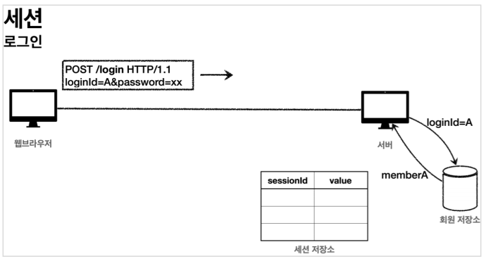
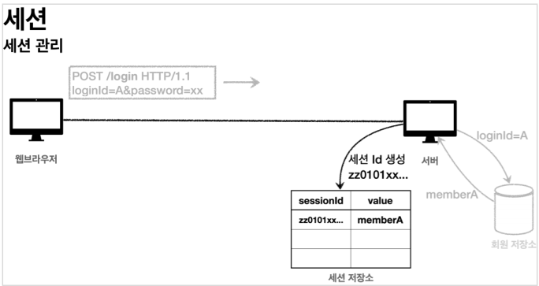
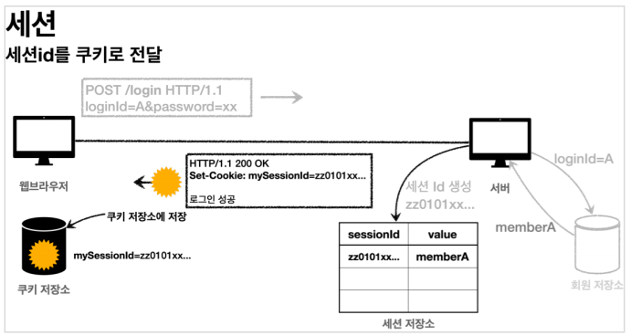
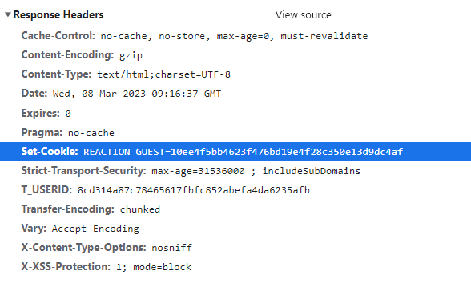
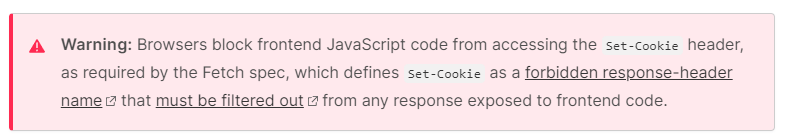
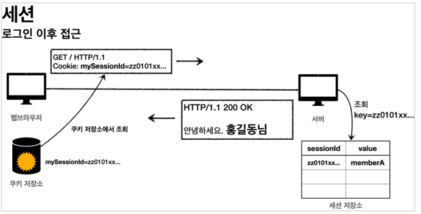
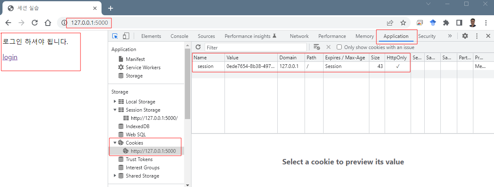
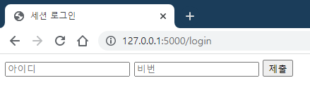
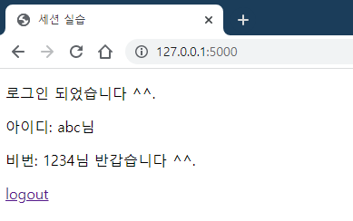
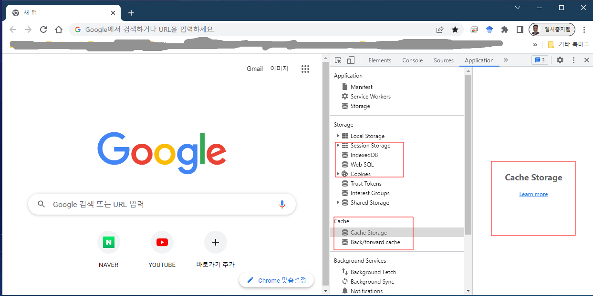

# 세션 (Session)

세션이란 서버가 자신에게 접근 요청 (request 메시지)를 보낸 클라이언트(사용자)를 구별하는 방법입니다. 

쿠키를 사용할 경우 네트워크 트랙픽이 증가할 수 있고, 보안에 취약하기 때문에 이를 보완하기 위해 세션이 등장하였습니다.

세션은 클라이언트(사용자 브라우저)에 정보를 저장하는 쿠키(cookie)와 다르게 서버에 정보를 저장합니다. 서버에 연결 정보가 저장되기 때문에 쿠키보다 관리가 용이하고 보안 측면에서 강력합니다.

세션은 클라이언트가 서버에 접속해서 브라우저를 종료할 때까지 인증상태를 유지합니다. 물론 세션도 유효 시간을 정할 수 있습니다. 일정 시간 동안 특별한 활동이 없다면 자동 로그아웃 되는 현상은 세션에 유효 시간이 설정되어 있기 때문입니다.

사용자별로 별도의 세션을 유지하기 위해 서버는 개별 클라이언트에게 고유한 번호를 부여하여 관리하게 됩니다. 이 때 발급되는 고유번호가 바로 `세션 아이디(Session ID)` 입니다.

## 세션의 장단점

모든 시스템에는 장단점이 있죠? 

장단점을 정리해 보았습니다.

|순번|구분|내용|
|:--|:--|:--|
|1 <td rowspan="5">장점</td> |서버에 저장하기 때문에 관리가 편리(클라이언트의 환경을 시시콜콜 신경쓰지 않아도 됩니다.)|
|2|어느정도 보안을 유지할 수 있음|
|3|웹 브라우저와 독립적으로 관리할 수 있음|
|4|세션의 저장 개수나 용량에 제약이 없음(서버 용량만 허용하면 모두 가능)|
|5|SessionID만 주고 받기 때문에 네트워크에 거의 부담을 주지 않음|
|6|단점|관리할 세션이 아주 많아지면 서버에 부담이 될 수도 있음|

## 세션과 쿠키 비교

세션은 쿠키와 유사하게 사용자를 구별하기 위해 만들어졌기 때문에 쿠키와 종종 비교하게 됩니다.

|구분|쿠키|세션|
|:--|:--|:--|
|저장위치|사용자 브라우저|서버 내부에 저장|
|보안|보통|우수|
|속도|빠름|보통(서버 처리시간 필요)|
|유효기간|장기간 살아있을 수 있음|시간 설정이 가능하지만 세션이 종료되면 무조건 만료|

여기서 이런 의문이 듭니다. 대부분의 경우 세션이 관리하기도 편하고 보안에도 강하지만 속도 차이가 별로 안 난다면 굳이 쿠키를 왜 쓸까요?

# 세션의 작동 방식

1. 클라이언트는 서버에게 웹사이트를 보여달라고 메시지를 보냅니다. `request` 메시지를 보내는 겁니다.

2. 만약 로그인을 하는 과정이라면 사용자 정보를 기반으로 사용자 DB에서 해당 정보를 찾아옵니다. 일반적이 접속이라면 request 헤더에서 클라이언트를 식별할 수 있는 정보를 활용할 수 있습니다. 로그인하는 경우를 살펴보면 다음과 같습니다.

    <div style="text-align:left">
        <figure>
            
            <figcaption>Request 접수하여 클라이언트 식별 정보 추출 (이미지 출처: 
            <a href="https://velog.io/@rlfrkdms1/%EC%BF%A0%ED%82%A4%EC%99%80-%EC%84%B8%EC%85%98%EC%9D%98-%EB%8F%99%EC%9E%91-%EC%9B%90%EB%A6%AC%EC%99%80-%EC%84%B8%EC%85%98%EC%9D%98-%EA%B5%AC%EC%A1%B0">Ddukddaki.log</a>)
            </figcaption>
        </figure>
    </div>

3. 클라이언트를 식별할 수 `sessionId`를 생성하고 `key`, `value` 쌍으로 구성하여 서버의 저장소에 저장합니다. 여기서 `key`는 `sessionID`이고, `value`는 클라이언트를 식별할 수 있는 객체가 됩니다. 만약 로그인 하는 상황이라면 사용자 `field`가 될 수 있습니다. 당연히 `sessionId`는 다른 사람이 `value` 값을 유추하지 못 하도록 만들어야 합니다.

    <div style="text-align:left">
        <figure>
            
            <figcaption>SessionId 생성하고 서버에 저장 (이미지 출처: 
            <a href="https://velog.io/@rlfrkdms1/%EC%BF%A0%ED%82%A4%EC%99%80-%EC%84%B8%EC%85%98%EC%9D%98-%EB%8F%99%EC%9E%91-%EC%9B%90%EB%A6%AC%EC%99%80-%EC%84%B8%EC%85%98%EC%9D%98-%EA%B5%AC%EC%A1%B0">Ddukddaki.log</a>)
            </figcaption>
        </figure>
    </div>

4. 서버는  response-header field인 `set-cookie` 값으로 `sessionId` 정보만 쿠키에 담아서 클라이언트에게 보냅니다. 클라이언트는 `sessionId`를 브라우저에 저장합니다. 이때 클라이언트에 저장되는 `sessionId` 값은 세션이 종료되면(브라우저를 닫으면) 같이 소멸되는 값입니다. 이를 `Memory cookie`라고 부릅니다. 일반적인 쿠키와는 좀 다릅니다.

    <div style="text-align:left">
        <figure>
            
            <figcaption>SessionID를 클라이언트에게 전송 (이미지 출처: 
            <a href="https://velog.io/@rlfrkdms1/%EC%BF%A0%ED%82%A4%EC%99%80-%EC%84%B8%EC%85%98%EC%9D%98-%EB%8F%99%EC%9E%91-%EC%9B%90%EB%A6%AC%EC%99%80-%EC%84%B8%EC%85%98%EC%9D%98-%EA%B5%AC%EC%A1%B0">Ddukddaki.log</a>)
            </figcaption>
        </figure>
    </div>
    
    - 클라이언트(브라우저)에 저장된 `sessionId` 값은 개발자도구 -> 네트워크 -> All 에서 확인할 수 있습니다.

    <div style="text-align:left">
        <figure>
            
            <figcaption>개발자도구를 이용한 sessionID 확인</figcaption>
        </figure>
    </div>

    - 일반적으로 서버가 `set-cookie`로 설정해서 쿠키를 보내면 기본값으로 `HttpOnly` 옵션이 설정됩니다. 정확하게는 다음과 같이 세팅이 되어 클라이언트(브라우저)에게 보냅니다.
        ```{bash}
        Set-Cookie: <cookie-name>=<cookie-value>; HttpOnly
        ```
    - `HttpOnly`이 설정되면 자바스크립트를 통해 세션 쿠키값에 접근하는 것을 차단합니다. 우리들은 볼 수 없고, 브라우저만 알고 있다는 의미입니다. 이렇게 설정하는 이유는 cross-site scripting ([XSS](https://developer.mozilla.org/en-US/docs/Glossary/Cross-site_scripting)) 공격의 위험을 감소시키기 위함입니다. XSS 공격은 나중에 배울 예정입니다.
    
    <div style="text-align:left">
        <figure>
            
            <figcaption>set-cookie 옵션 사용에 대한 경고</figcaption>
        </figure>
    </div>    
    

4. 서버에서는 HTTP Request를 통해 쿠키에서 Session id를 확인을 한 후에 없으면 Set-Cookie를 통해 새로 발행한 Session-id 보냅니다. 

5. 클라이언트는 HTTP Request 헤더에 Session id를 포함하여 원하는 Resource를 요청을 합니다.

    <div style="text-align:left">
        <figure>
            
            <figcaption>클라이언트는 자신의 sessionID 서버에 전송 (이미지 출처: 
            <a href="https://velog.io/@rlfrkdms1/%EC%BF%A0%ED%82%A4%EC%99%80-%EC%84%B8%EC%85%98%EC%9D%98-%EB%8F%99%EC%9E%91-%EC%9B%90%EB%A6%AC%EC%99%80-%EC%84%B8%EC%85%98%EC%9D%98-%EA%B5%AC%EC%A1%B0">Ddukddaki.log</a>)
            </figcaption>
        </figure>
    </div>

6. 서버는 Session id를 통해 해당 세션을 찾아 클라이언트 상태 정보를 유지하며 적절한 응답을 합니다.


# 세션 실습

## 실습 내용
  - 플라스크 확장기능을 이용하여 서버에서 관리하는 세션을 구축
  - 세션은 클라이언트가 서버에 로그인 해서 로그 아웃하는 시간동안 유효
  - 세선에 대한 정보는 서버의 임시 디렉토리에 저장
  - 암호화된 쿠키 데이터 생성하고 쿠키 기반으로 저장
  - 개별 클라이언트는 자신의 세션에 각각 저장된 데이터를 이용하여 세션을 유지
  - 사용자는 세션을 이용하여 접속하고, 접속 이후 일정시간 세션을 유지

## 의존성 설치
 
Flask 세션 확장팩 (`Flask-Session`) 설치 (가상환경에서 작업할 것을 강력히 권고합니다.)

```{python}
$ pip install Flask-Session
```

## 세션 설정 및 초기화

플라스크는 `session` 객체를 지원합니다.

하지만 `session`에 직접 접근할 수 없으며, `flask_session` 객체를 통해 접근할 수 있습니다.

개별 사용자는 각자의 `session`을 갖게 됩니다. 

```{python}
from flask import Flask, render_template, redirect, request, session
from flask_session import Session
```

플라스크 세션에 필요한 설정

프로젝트 디렉토리를 만듭니다. 본 예제에서는 `session_practice`라는 디렉토리를 만들었습니다. 프로젝트 디렉토리 안에 서버를 코딩을 위한 파일을 만듭니다. 저는 `session_server.py` 라는 이름을 붙여 주었습니다.
디렉토리 구조는 다음과 같습니다.

```{bash}
--- session_practice
                    |
                    cookie_server.py
```

- `SESSION_PERMANENT`
  - 세션의 유효시간을 설정합니다. Default 값은 `True` 입니다. 
  - `True`인 경우 브라우저가 켜져 있는 한 세션이 유효
  - `False`인 경우 정해진 시간이 지나면 세션을 종료
    - 세션 유효 시간은 `PERMANENT_SESSION_LIFETIME` 값을 이용
- `PERMANENT_SESSION_LIFETIME`
  - 세션의 유효시간을 지정합니다. 인자값으로 `datetime.timedelta` 또는 정수값(초) 지정
- `SESSION_TYPE`
  - 세션 정보를 어떻게 관리할 것인지 선택합니다. 기본값(default)은 `null` 입니다.
  - `null`: 기본값, 읽기 전용으로 세션에 접근할 수 있지만 설정은 불가
  - `redis`: `redis` 데이터베이스를 사용, [redis-py](https://github.com/redis/redis-py) 모듈 필요
  - `memcached`: 인 메모리 데이터 스토어 `memcached` 사용, [pylibmc](http://sendapatch.se/projects/pylibmc/) 또는 [memcache](https://github.com/linsomniac/python-memcached) 모듈 필요
  - `filesystem`: 서버의 로컬 파일 시스템에 저장, 세션 데이터베이스 대신하는 역할
  - `mongodb`: `MongoDB` 사용, [pymongo](https://pymongo.readthedocs.io/en/stable/) 모듈 필요
  - `sqlalchemy`: `Sqlalchemy` 사용, [Flask-SQLAlchemy](https://flask-sqlalchemy.palletsprojects.com/en/3.0.x/) 모듈 필요

플라스크 세션 설정에 대한 자세한 내용은 [공식문서](https://flasksession.readthedocs.io/en/latest/)를 참고하시기 바랍니다.

```{python}
app = Flask(__name__)
app.config["SESSION_PERMANENT"] = False         # 세션 설정: 유효시간 사용
app.config["PERMANENT_SESSION_LIFETIME"] = 30   # 세션 설정: 유효시간 설정
app.config["SESSION_TYPE"] = "filesystem"       # 세션 설정: 서버의 파일 시스템 활용
Session(app)                                    # 세션 초기화
```

## 템플릿 작성

프로젝트 디렉토리를 `session_practice` 그 안에 `templates`라는 디렉토리를 생성합니다.

우선 `templates` 폴더 안에 `index.htm`, `login.html` 파일을 만듭니다.

```{bash}
--- session_practice
        |
        ---- templates
        |       |
        |       |---- index.html    
        |       |
        |       |---- login.html    
        cookie_server.py
```

### 접속 페이지 `index.html`

사용자가 처음 접속하면 보여줄 화면을 작성합니다.

아래와 같이 작성합니다.

```{html}
<!DOCTYPE html>
<html lang="en">
<head>
    <meta charset="UTF-8">
    <meta http-equiv="X-UA-Compatible" content="IE=edge">
    <meta name="viewport" content="width=device-width, initial-scale=1.0">
    <title>세션 실습</title>
</head>
<body>
    
        <p>로그인 되었습니다 ^^.</p>  
        <p>아이디: {{ session.id }}님</p>
        <p>비번: {{ session.passwd }}님 반갑습니다 ^^.</p>
        <p><a href="/logout">logout</a></p>
    
        <p>로그인 하셔야 됩니다.</p> 
        <p><a href="/login">login</a></p>
    
</body>
</html>
```

### 로그인 페이지 `login.html`

웹사이트 방문자를 로그인

```{html}
<!DOCTYPE html>
<html lang="en">
<head>
    <meta charset="UTF-8">
    <meta http-equiv="X-UA-Compatible" content="IE=edge">
    <meta name="viewport" content="width=device-width, initial-scale=1.0">
    <title>세션 로그인</title>
</head>
<body>
    <form action="/login" method="POST">
        <input placeholder="아이디" autocomplete="off" type="text" name="id">
        <input placeholder="비번" autocomplete="off" type="text" name="passwd">
        <input type="submit" name="Register">
    </form>
</body>
</html>
```


## 서버 코딩 

사용자가 웹사이트를 방문하면 메인 화면으로 `index.html` 파일을 제공하고, 로그인을 선택하면 `login.html`을 보여 줍니다.

이전에 작업하던 `session_server.py`에 다음 내용을 추가합니다.

```{python}
@app.route("/")
def index():
    '''메인화면 index.html 처리'''
    return render_template('index.html')
```

로그인 화면으로 이동하거나 접속한 경우(`GET` 요청) 로그인 화면을 그대로 보여줍니다.

만약 로그인 화면에서 `form`에 정보를 입력하고 `제출` 버튼을 누른 경우 (`POST` 요청)인 경우 form에서 필요한 정보를 추출하고 세션에 필요한 정보를 등록합니다.

세션에 정보 등록이 끝나면 메인 화면으로 이동시켜 줍니다.

아래와 같이 코딩해 줍니다. `session_server.py`에 다음 내용을 추가합니다.


```{python}
@app.route("/login", methods=["POST", "GET"])
def login():
    '''로그인 처리'''
    # 만약 form을 작성하여 제출하면 (POST 전송)
    if request.method == "POST":

    	# 아이디와 비번을 세션에 등록
        session["id"] = request.form.get("id")
        session["passwd"] = request.form.get("passwd")

        # 로그인이 끝났으므로 메인 화면으로 이동
        return redirect("/")

	# 만약 일반 접속(GET 전송)이라면 로그인 페이지를 제공
    return render_template("login.html")
```

사용자가 로그아웃 버튼을 클릭한 경우에 서버에서 처리할 함수를 코딩합니다.

로그아웃 요청이 오면 세션에 등록한 정보를 초기화 하고 메인 화면으로 안내합니다.

아래와 같이 코딩해 줍니다. `session_server.py`에 다음 내용을 추가합니다.

```{python}
@app.route("/logout")
def logout():
    '''로그아웃 처리'''

    # 세션 초기화
    session["id"] = None
    session["passwd"] = None

    # 메인 화면으로 안내
    return redirect("/")
```

완성된 세션 서버 `session_server.py` 전체 코드는 다음과 같습니다.

```{python}
'''청주대학교 세션 실습 코드: session_server.py'''

from flask import Flask, render_template, redirect, request, session
from flask_session import Session

app = Flask(__name__)
app.config["SESSION_PERMANENT"] = False
app.config["PERMANENT_SESSION_LIFETIME"] = 30  # 세션 유효기간 30초 설정
app.config["SESSION_TYPE"] = "filesystem"

# 세션 초기화 방법 1
Session(app)

# 세션 초기화 방법 2
# sess = Session()
# sess.init_app(app)


@app.route("/")
def index():
    '''메인화면 index.html 처리'''
    return render_template('index.html')


@app.route("/login", methods=["POST", "GET"])
def login():
    '''로그인 처리'''
    # 만약 form을 작성하여 제출하면 (POST 전송)
    if request.method == "POST":

    	# 아이디와 비번을 세션에 등록
        session["id"] = request.form.get("id")
        session["passwd"] = request.form.get("passwd")

        # 로그인이 끝났으므로 메인 화면으로 이동
        return redirect("/")

	# 만약 일반 접속(GET 전송)이라면 로그인 페이지를 제공
    return render_template("login.html")


@app.route("/logout")
def logout():
    '''로그아웃 처리'''

    # 세션 초기화
    session["id"] = None
    session["passwd"] = None

    # 메인 화면으로 안내
    return redirect("/")
```

`sever` 폴더로 이동한 다음 아래 명령어를 차례로 실행합니다.

```{bash}
$ export FLASK_APP=session_server
$ export FLASK_DEBUG=true
$ flask run
```

참고: 윈도우 환경에서 사용할 경우 `export` 대신 `set` 명령어를 사용하면 됩니다. 만약 윈도우 환경이지만 `git bash` 쉘을 사용하는 경우에는 `export` 명령어를 그대로 사용해도 됩니다.

다음부터 3줄 명령어를 일일히 타이핑 하기 귀찮다면 shell 프로그램을 작성해 두면 편리합니다.
`server`폴더 아래에 파일명 `run.sh`로 작성해 보겠습니다.

```{bash}
export FLASK_APP=cookie_server
export FLASK_DEBUG=true
flask run
```

다음부터는 `. run.sh` 라고 명령하면 위 3줄 명령어가 순차적으로 실행됩니다.

터미널에서 쉡 스크립트를 실행합니다.
```{bash}
$ . run.sh
```

브라우저 주소창에 `127.0.0.1:5000` 입력하면, 우리가 만든 세션 서버가 보내주는 `index.html`을 만나게 됩니다.

로그인 안되었을 경우 내용을 볼 수 있습니다.
개발자도구 $\to$ Application $\to$ Cookies 를 확인하면 세션 쿠키가 잘 발행된 것을 확인할 수 있습니다.

<div style="text-align:left">
    <figure>
        
        <figcaption>최초 접속 상태</figcaption>
    </figure>
</div>

로그인(`login`) 버튼을 누르면 아이디와 

<div style="text-align:left">
    <figure>
        
        <figcaption>로그인 화면</figcaption>
    </figure>
</div>


아이디와 비번을 입력하고 `제출` 버튼을 누르면 서버에서 보내준 세션 정보를 활용한 내용을 볼 수 있습니다.
실습 예제로 아이디는 `abc`, 비번은 `1234`를 입력하고 `제출` 버튼을 눌러 보겠습니다. 

아래와 같은 화면이 나옵니다.

<div style="text-align:left">
    <figure>
        
        <figcaption>로그인 이후 화면</figcaption>
    </figure>
</div>


서버(`session_server.py`)에서 세션 유효기간을 30초로 지정했었습니다.

```{python}
app.config["SESSION_PERMANENT"] = False
app.config["PERMANENT_SESSION_LIFETIME"] = 30  # 세션 유효기간 30초 설정
```

30초 지나서 페이지를 새로고침 하면 세션 내용이 자동으로 초기화 되기 때문에 로그인 상태가 더 이상 유지되지 않습니다. 최초 접속화면으로 안내되는 것을 확인할 수 있습니다. 

브라우저가 살아 있으면 세션을 유지하고 싶다면 위 코드를 삭제하면 됩니다.

브라우저를 완전히 종료되지 않고, 세션 유효 시간이 남아 있다면 접속 창을 닫았다가 다시 접속해도 여전히 로그인 상태는 유지됩니다. 

하지만 모든 브라우저를 종료했다가 다시 시작하면 이전에 우리가 접속했던 `127.0.0.1:5000` 서버에 대한 접속 세션 정보가 모두 사라집니다.

<div style="text-align:left">
    <figure>
        
        <figcaption>로그인 이후 화면</figcaption>
    </figure>
</div>


여러분들도 한번 확인해 보시기 바랍니다.

## 세션의 특징을 다시 한번 확인

브라우저에서는 세션 아이디(`sessionID`)값만 확인할 수 있습니다. 세션 아이디 값으로는 구체적인 정보를 유추하기 어렵습니다. 세부 정보는 서버에 저장하고 있기 때문입니다.

또한 `sessionId` 값은 자바스크립트가 접근할 수 없기 때문에 해커들이 정보를 훔쳐가기 쉽지 않습니다. 접속한 브라우저가 실행된 내 컴퓨터에 접속한다면 혹시 가능할 수도 있습니다.

하지만 인터넷 작업을 마치고 브라우저를 종료하면 세션 정보가 완전히 사라지기 때문에 서버 접속 정보를 알기 더욱 힘듭니다.

이런 이유로 세션이 쿠키보다 보안 측면에서 강력하다고 이야기 합니다.


# References
|Title|Author|Source|Link|
|:--|:--|:--|:--|
|Session, HttpSession 인터페이스, 쿠키|dmchoi.log|개인 블로그|[link](https://velog.io/@dmchoi224/Session-HttpSession-%EC%9D%B8%ED%84%B0%ED%8E%98%EC%9D%B4%EC%8A%A4.-%EC%BF%A0%ED%82%A4)|
|쿠키와 세션 개념|RyanGomdoriPooh|개인 블로그|[link](https://interconnection.tistory.com/74)|
|Set-Cookie|Mdn web docs|MDN 공식문서|[link](https://developer.mozilla.org/en-US/docs/Web/HTTP/Headers/Set-Cookie)|
|How to use Flask-Session in Python Flask?|GeeksforGeeks|블로그(외국)|[link](https://www.geeksforgeeks.org/how-to-use-flask-session-in-python-flask/)|
|Flask-Session|Flask-Session|공식문서|[link](https://flasksession.readthedocs.io/en/latest/)|
|Flask permanent session: where to define them?|patb|StackOverflow|[link](https://stackoverflow.com/questions/34118093/flask-permanent-session-where-to-define-them)|
|Python - Flask(session) / 로그인, 회원정보 수정, 로그아웃, 회원리스트 받아오기|by 빵으니 2020. 6. 1.|개인 블로그|[link](https://velog.io/@dmchoi224/Session-HttpSession-%EC%9D%B8%ED%84%B0%ED%8E%98%EC%9D%B4%EC%8A%A4.-%EC%BF%A0%ED%82%A4)|
