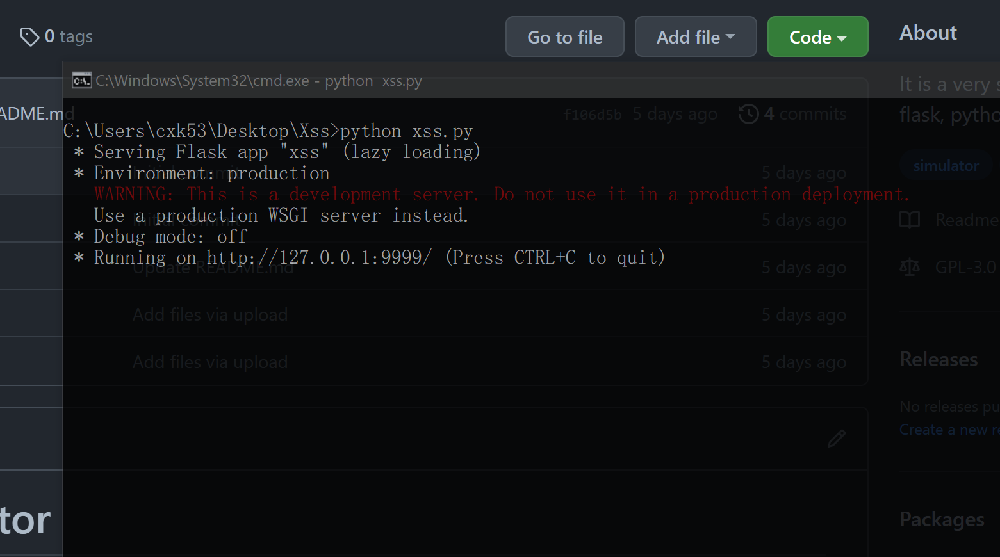
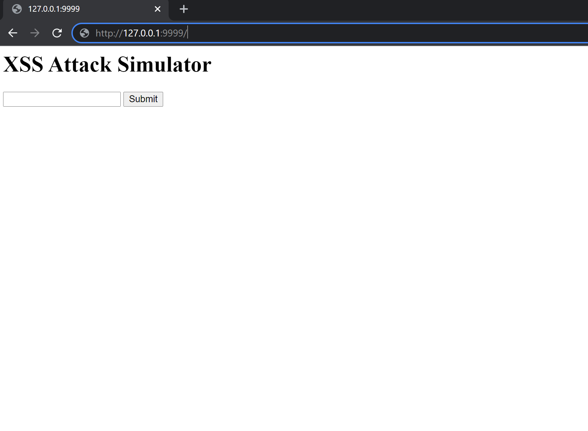
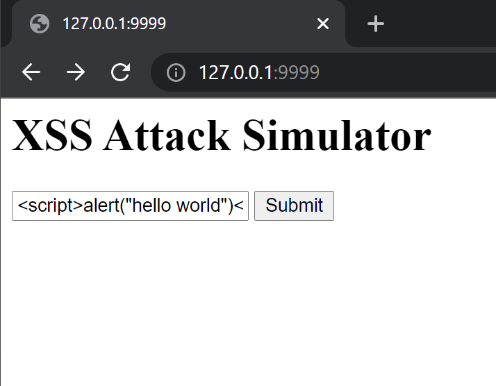
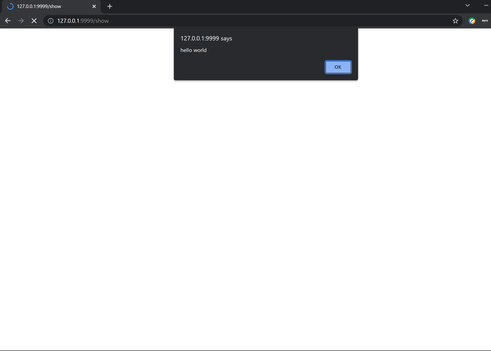

# Xss-Simulator
It is a very simple XSS simulator based on Flask, Python.

This is a repository that explains XSS attack. We will run a local web program to learn XSS by experencing and attempting.

# Introducing XSS
XSS stands for cross-site scripting. The terminology cross-site scripting was originally abbreviated as CSS, but the word cascading style sheets is also called CSS, so people changed the abbreviation of cross-site scripting to XSS.

# Requirements
- markdown
- flask

see [requirements.txt](requirements.txt)

# How to Run
## 1. Download code

## 2. Run code
`python xss.py`

## 3. Open the webpage in browser

## 4. Input / Inject

## 5. Click the button to see result

This is just an example, actually you can do something more interesting!
